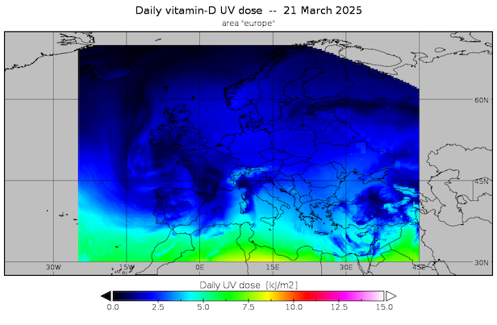
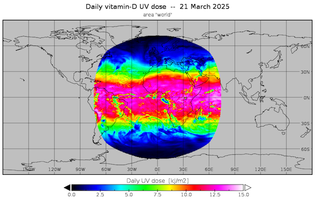
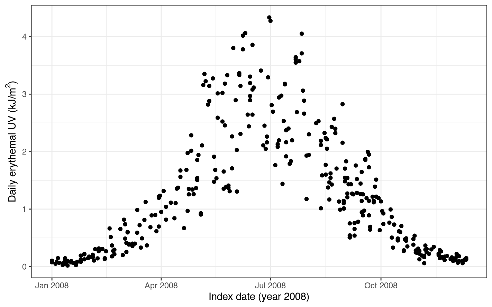
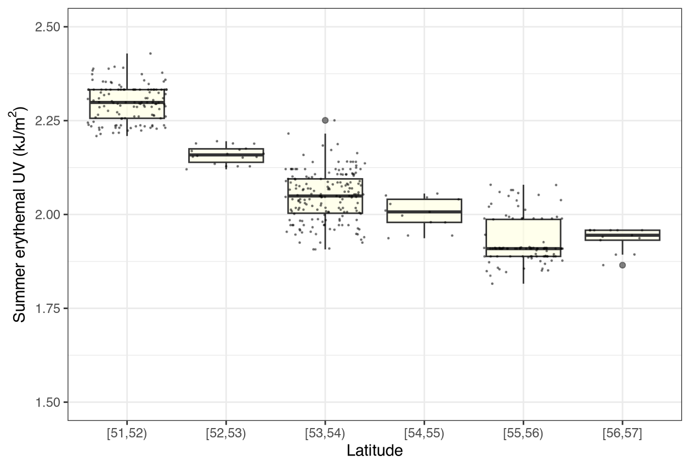
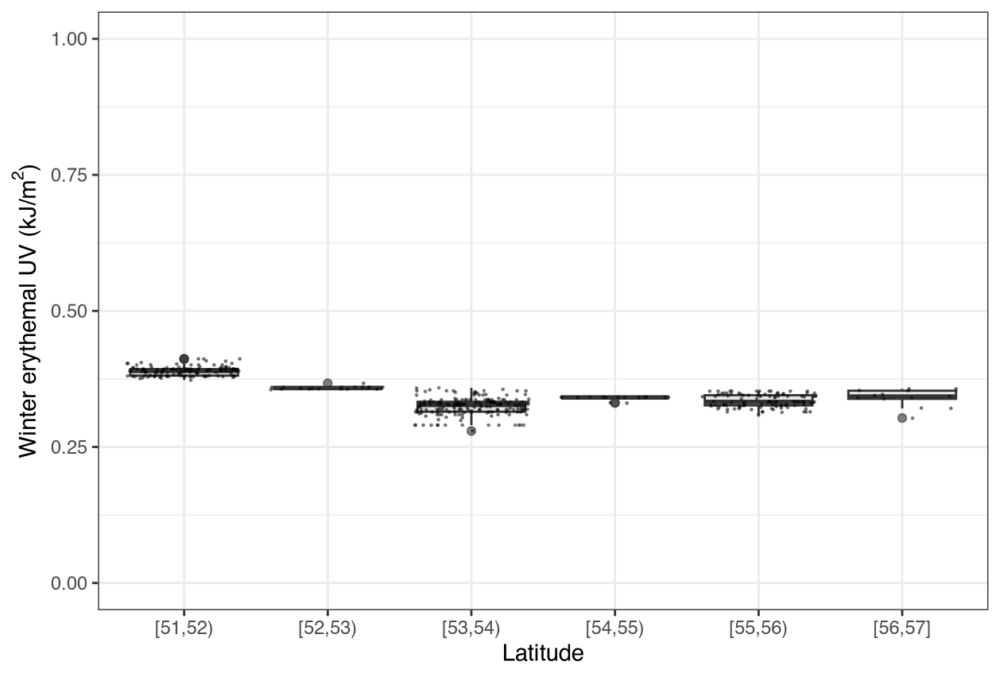
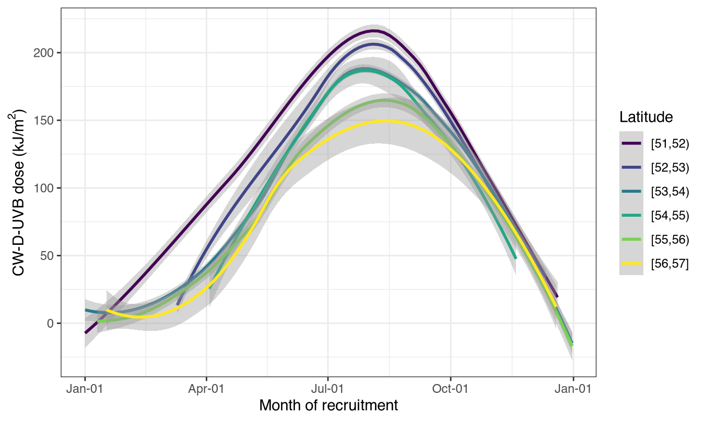

## Introduction

**UVdose** is an R package for the manipulation of ambient UV data from the Tropospheric Emission Monitoring Internet Service (TEMIS). TEMIS is a web-based service to browse and download atmospheric satellite data products. More information about TEMIS is available on their website <https://www.temis.nl/>. UVdose was built to facilitate the integration of UV data into health research. The package functions allow the estimation of daily, seasonal, and annual doses of UVB and erythemal UV based on geographical coordinates and dates. Additionally, a function to estimate a cumulative and weighted UVB dose relevant for vitamin D production in the skin is available.

The following document describes a potential workflow for estimating and describing ambient UV doses using the **UVdose** package. UV data is downloaded from the TEMIS database (more details below in [2. Download UV data from TEMIS]). The examples below are based on mock sample data (e.g. cohort or clinical trial data).

Install the package from CRAN (pending submission/approval).


``` r
#install.packages("UVdose")
```

Load the package.


``` r
library(UVdose)
```

## Workflow

1.  Pre-process sample data
2.  Download UV data from TEMIS
3.  Calculate relevant UV dose
4.  Visualisation and downstream analysis

### 1. Pre-process sample data

The first step is to clean up the data and get it ready for analysis. Here we are using a mock sample dataset. The input dataset must have date and geographical coordinate columns. The UV dose functions require longitude and latitude coordinates. However, given that some UK datasets, like the widely used UK Biobank cohort, use OSGB coordinates, two functions that convert OSGB to geographical (lon/lat) coordinates are also included: `latitude()` and `longitude()`. OSGB coordinates must be converted to geographical coordinates. Finally, the required columns cannot contain any missing values.


``` r
#read in data file with sample data
mydata <- read.csv("sample_data.csv")
head(mydata)
```

```
##   sample_id       date easting northing followup_vitD disease
## 1   id00001 2007-10-08  463000   225000         65.91       1
## 2   id00002 2008-08-09  464000       NA         88.99       1
## 3   id00003 2008-05-06  426000   576000         90.28       1
## 4   id00004 2008-07-27  363000   170000        107.77       0
## 5   id00005 2008-02-22  381000   409000         72.50       0
## 6   id00006 2008-02-20  428000   567000         81.13      NA
```

``` r
#check whether the input data is ok using the uv_data_check function
uv_data_check(mydata)
```

```
## [1] "Looks like your data has OSGB coordinates! Use the longitude and latitude functions first to convert 'easting' and 'northing' columns."
```

``` r
#data has some missing values, remove all missing values 
mydata <- drop_na(mydata) #drop_na() from tidyr

#coordinates are in OSGB grid, convert to geographical coordinates using the latitude() and longitude() functions
mydata$lat <- latitude(data = mydata, easting = easting, northing = northing)
mydata$lon <- longitude(data = mydata, easting = easting, northing = northing)

#date must be in date format
mydata$date <- as.Date(mydata$date)

head(mydata)
```

```
##   sample_id       date easting northing followup_vitD disease      lat         lon
## 1   id00001 2007-10-08  463000   225000         65.91       1 51.91952 -1.08385328
## 2   id00003 2008-05-06  426000   576000         90.28       1 55.07771 -1.59272215
## 3   id00004 2008-07-27  363000   170000        107.77       0 51.42731 -2.53224989
## 4   id00005 2008-02-22  381000   409000         72.50       0 53.57701 -2.28698401
## 5   id00007 2008-11-18  461000   185000         92.41       0 51.56010 -1.11994859
## 6   id00009 2008-09-24  534000   187000         95.65       1 51.56546 -0.06647931
```

### 2. Download UV data from TEMIS

TEMIS data can then be downloaded for a given date range, by year, and for the region 'Europe' or 'World'. The areas covered by each region are shown in the figures below. Cloud-adjusted records are available from 2004 until the present year (2025 at the time of writing). The main annual files provide total daily UV measurements in 0.25°x0.25° grid cells. This package uses the cloud-adjusted UV values. Files are updated monthly but please allow for occasional month-to-month delays. Additionally, for various technical reasons, some days are missing UV observations. TEMIS provides a climatology file, which is a UV file with values averaged across 2004-2020 and is used in the downstream functions to fill in these missing observations. See \<www.temis.nl\> for detailed information.

Area cover for the region options "europe" and "world": the maps below show coverage for cloud-adjusted daily vitamin D UV but the same area is covered for erythemal UV as well.

Europe: {width="499"}

World: {width="499"}


``` r
#for this sample, data was collected between 2006 and 2008
range(mydata$date)
```

```
## [1] "2006-04-22" "2008-12-11"
```

``` r
#download the TEMIS UV files needed to perform the next UV calculations
#the examples will use erythmal UV relevant for skin cancer

if(!all(file.exists(c("2005_uvdec_europe.nc","2006_uvdec_europe.nc","2007_uvdec_europe.nc", "2008_uvdec_europe.nc","europe_uvdec_climatology.nc")))) {
    temis_uvdec(years = mydata$date, path = getwd(), climatology = T, region = "europe")
  }
```

### 3. Calculate relevant UV dose

For example, you may want to calculate daily ambient erythemal UV exposure or by seasons using summer (April-September) and winter (October-March). Alternatively, you can input a numeric vector if a specific month range is of interest (e.g. c(1:3) or c(6:8,9:11)). The dose is estimated from the year ending in the index date (for example, for a participant recruited on "2007-10-08", the summer UV dose is estimated from April to September 2007 while the winter dose from October 2006 to March 2007).


``` r
#first calculate daily erythemal UV
mydata$day_uve <- daily_uve(data = mydata, date = date, longitude = lon, latitude = lat)

#then seasonal values:
#to calculate average erythemal UV over a season we use the season_uve() function
#first the summer dose
mydata$summer_uve <- season_uve(data = mydata, date = date, longitude = lon, latitude = lat,
                                season = "summer", type = "mean")

#then similarly for the winter dose
mydata$winter_uve <- season_uve(data = mydata, date = date, longitude = lon, latitude = lat,
                                season = "winter", type = "mean")

#check the newly calculated data 
head(mydata)
```

```
##   sample_id       date easting northing followup_vitD disease      lat         lon
## 1   id00001 2007-10-08  463000   225000         65.91       1 51.91952 -1.08385328
## 2   id00003 2008-05-06  426000   576000         90.28       1 55.07771 -1.59272215
## 3   id00004 2008-07-27  363000   170000        107.77       0 51.42731 -2.53224989
## 4   id00005 2008-02-22  381000   409000         72.50       0 53.57701 -2.28698401
## 5   id00007 2008-11-18  461000   185000         92.41       0 51.56010 -1.11994859
## 6   id00009 2008-09-24  534000   187000         95.65       1 51.56546 -0.06647931
##   day_uve summer_uve winter_uve
## 1   0.721   2.294760  0.3755934
## 2   3.159   2.012522  0.3488734
## 3   4.052   2.373676  0.4035628
## 4   0.215   2.040738  0.3275604
## 5   0.203   2.258481  0.3868462
## 6   1.216   2.223571  0.3847814
```

### 4. Visualisation and downstream analysis

We can then perform downstream analyses and visualise the UV dose estimates. Please note the examples below are based on randomly generated trial or cohort data, not real world observations. For example, clinical trial participants might be recruited and followed up different dates. To remove the seasonality noise from the effect of vitamin D level on the disease outcome, you can adjust the vitamin D measurement for the ambient sun exposure at the time. The `cw_uvb()` function estimates an ambient cumulative and weighted vitamin D UVB dose assuming vitamin D will accumulate and get used up in the body over time (see [O'Sullivan et al., 2017](https://doi.org/10.3945/jn.116.244079){.uri} and [Wyse et al., 2021](https://doi.org/10.1038/s41598-021-90019-7) for further discussion).


``` r
mydata$cw_d_uvb <- cw_uvb(data = mydata, date = date, longitude = lon, latitude = lat)
```

```
## Calculating CW-D-UVB... Sit tight, this may take a few minutes!
```

```
## For longitudes -4.36741212322941 and -0.0072268410076245 Nearest grid values are: -4.375 and 0.125
```

```
## For latitudes 51.3418059708543 and 56.0348186255475 Nearest grid values are: 51.125 and 56.125
```

``` r
#does vitamin D level affect the risk of getting the disease?
#model not adjusted for UV dose
m1 <- lm(disease ~ followup_vitD, mydata)
summary(m1)
```

```
## 
## Call:
## lm(formula = disease ~ followup_vitD, data = mydata)
## 
## Residuals:
##     Min      1Q  Median      3Q     Max 
## -0.5296 -0.4972 -0.4752  0.5014  0.5239 
## 
## Coefficients:
##                 Estimate Std. Error t value Pr(>|t|)    
## (Intercept)    0.5472887  0.1327572   4.122 4.47e-05 ***
## followup_vitD -0.0005747  0.0015159  -0.379    0.705    
## ---
## Signif. codes:  0 '***' 0.001 '**' 0.01 '*' 0.05 '.' 0.1 ' ' 1
## 
## Residual standard error: 0.501 on 446 degrees of freedom
## Multiple R-squared:  0.0003221,	Adjusted R-squared:  -0.001919 
## F-statistic: 0.1437 on 1 and 446 DF,  p-value: 0.7048
```

``` r
#model adjusted for UV dose
#use vitamin D residuals after regressing CW-D-UVB (cumulative and weighted vitamin D-UVB dose)
mydata$followup_vitD_adj <- residuals(lm(followup_vitD ~ cw_d_uvb, mydata))
m2 <- lm(disease ~ followup_vitD_adj, mydata)
summary(m2)
```

```
## 
## Call:
## lm(formula = disease ~ followup_vitD_adj, data = mydata)
## 
## Residuals:
##     Min      1Q  Median      3Q     Max 
## -0.5724 -0.4965 -0.4387  0.5013  0.5608 
## 
## Coefficients:
##                    Estimate Std. Error t value Pr(>|t|)    
## (Intercept)        0.497768   0.023653  21.045   <2e-16 ***
## followup_vitD_adj -0.001708   0.001843  -0.926    0.355    
## ---
## Signif. codes:  0 '***' 0.001 '**' 0.01 '*' 0.05 '.' 0.1 ' ' 1
## 
## Residual standard error: 0.5006 on 446 degrees of freedom
## Multiple R-squared:  0.001921,	Adjusted R-squared:  -0.0003169 
## F-statistic: 0.8584 on 1 and 446 DF,  p-value: 0.3547
```

Or visualise the distribution of daily doses.


``` r
mydata$month <- month(mydata$date, label = T) #month() from lubridate

dplyr::filter(mydata, year(date) == "2008") %>%
  ggplot(aes(x=date, y=day_uve)) +
  geom_point() +
  theme_bw() +
  xlab("Index date (year 2008)") +
  ylab(expression("Daily erythemal UV (kJ/m"^2*")")) 
```

<div class="figure">

<p class="caption">Daily UVE 2008</p>
</div>

Or compare the distribution of summer and winter erythemal UV by latitude.


``` r
range(mydata$lat)
```

```
## [1] 51.34181 56.03482
```

``` r
mydata$lat_bin <- cut(mydata$lat, breaks=51:57, include.lowest=TRUE, right=FALSE)

ggplot(mydata, aes(x=lat_bin, y=summer_uve)) +
  geom_boxplot(fill="lightyellow", alpha=0.6) +
  geom_jitter(color="black", size=0.2, alpha=0.4) +
  theme_bw() +
  xlab("Latitude") +
  ylab(expression("Summer erythemal UV (kJ/m"^2*")")) +
  ylim(c(1.5,2.5))

ggplot(mydata, aes(x=lat_bin, y=winter_uve)) +
  geom_boxplot(fill="lightgrey", alpha=0.6) +
  geom_jitter(color="black", size=0.2, alpha=0.4) +
  theme_bw() +
  xlab("Latitude") +
  ylab(expression("Winter erythemal UV (kJ/m"^2*")")) +
  ylim(c(0,1))
```

<div class="figure">

<p class="caption">Summer vs winter UVE</p>
</div>

Or explore trends in the vitamin D dose, CW-D-UVB, by latitude and across the year.


``` r
#add a dummy year to plot all years together
mydata$plot_date <- as.Date(format(mydata$date, "2000-%m-%d"))

ggplot(mydata, aes(x = plot_date, y=cw_d_uvb, group=lat_bin, color=lat_bin)) +
  geom_smooth()+
  scale_x_date(date_labels = "%b-%d") +
  scale_colour_viridis_d(name="Latitude") +
  theme_bw() +
  xlab("Month of recruitment") +
  ylab(expression("CW-D-UVB dose (kJ/m"^2*")"))
```

```
## `geom_smooth()` using method = 'loess' and formula = 'y ~ x'
```

<div class="figure">

<p class="caption">Latitude CW-D-UVB</p>
</div>

## Citation

Please inform TEMIS on publication or reuse of data at <https://www.temis.nl/contact.php>. Please cite the UVdose package in publications.
